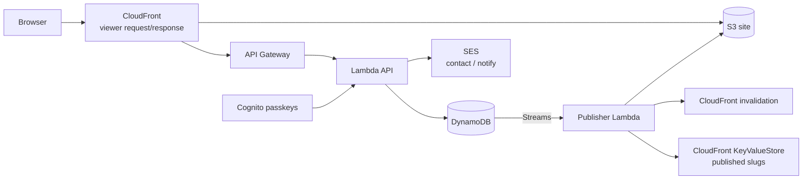

# gagnechris.com

Personal site and headless CMS for [gagnechris.com](https://gagnechris.com): statically prerendered public pages, an admin UI with Cognito passkeys, draft → publish for posts / home / resume, and a Notebook (coming).

> Looking for the GitHub **profile** intro? That’s the root [`README.md`](../README.md).

## Architecture at a glance



Public HTML (home, resume, blog posts), `posts.json`, `sitemap.xml`, `rss.xml`, and `resume.pdf` are written by the **publisher** on publish — not by the Vite web build.

## Quickstart (local admin)

Requires Node.js 22.12+ (see `.nvmrc`) and Docker (DynamoDB Local).

```bash
nvm use
npm ci
npm run local:dev
```

Open [http://localhost:5173/admin](http://localhost:5173/admin). Local mode uses a fake signed-in session (`VITE_AUTH_MODE=local`) and never touches production AWS.

Useful commands:

```bash
npm test
npm run typecheck
npm run lint
npm run e2e:local
```

`npm run dev` starts Vite only (API proxied to local by default). To hit **production** APIs from Vite, use `npm run dev:prod-api` — it prints a PRODUCTION banner; prefer `local:dev` for day-to-day work.

## Repo layout

```
apps/web/              React/Vite site + admin
services/api/          Lambda HTTP API (posts, home, resume, contact, auth)
services/publisher/    DynamoDB Streams → prerender HTML/PDF/RSS/sitemap
packages/shared/       Shared types, schemas, HTML helpers
infra/                 AWS CDK (CloudFront, S3, API, Cognito, SES, …)
scripts/               Local stack, deploy-web, branch protection
docs/                  Architecture, development, data model, E2E
```

## Workflow

- One Linear ticket → one branch → one PR into `main` (prefer the issue `gitBranchName`)
- CI on PRs: lint, typecheck (all workspaces), tests, build, CDK diff
- Merge to `main` deploys via OIDC (CDK + web sync + CloudFront invalidation)
- Infrastructure only through CDK — no console edits to production

## Docs

- [docs/README.md](../docs/README.md) — index
- [docs/architecture.md](../docs/architecture.md)
- [docs/development.md](../docs/development.md)
- [docs/data-model.md](../docs/data-model.md)
- [docs/local-e2e.md](../docs/local-e2e.md)
- [docs/migrate-posts.md](../docs/migrate-posts.md)
- [infra/RUNBOOK.md](../infra/RUNBOOK.md) — AWS operations

## Contributions

Issues welcome. Not accepting pull requests (this is a personal site; fork PRs cannot run the AWS deploy workflows).

## License

- **Code:** [MIT](../LICENSE) — `Copyright (c) 2026 Chris Gagne`
- **Content:** [CONTENT-LICENSE](../CONTENT-LICENSE) — blog posts, resume, bio, photos, and artwork (including Don’t Feed the Bears) are © Chris Gagne, all rights reserved
- **Third-party:** Inter fonts for resume PDFs remain under the SIL Open Font License — see [`services/publisher/assets/fonts/`](../services/publisher/assets/fonts/)
